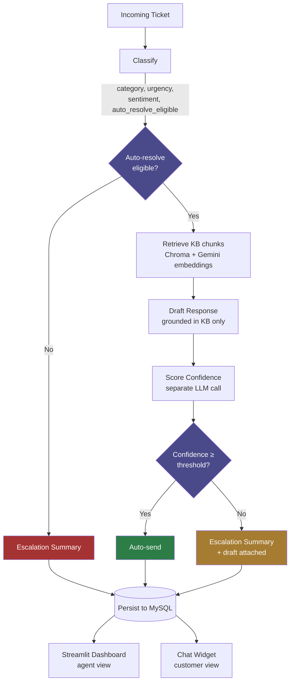
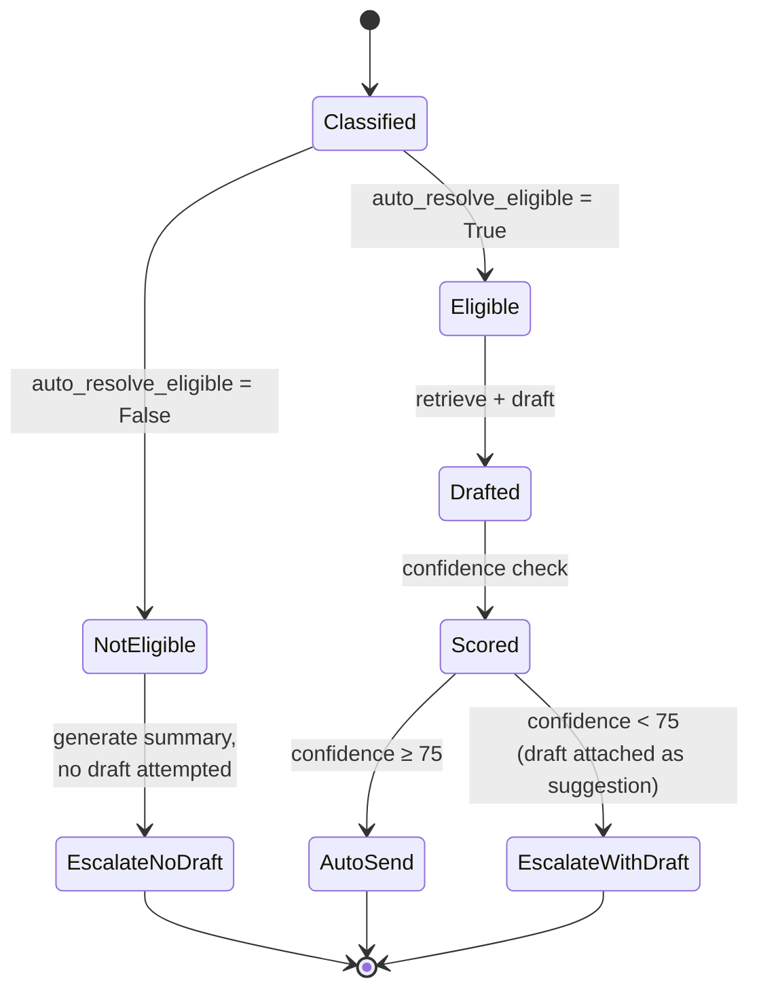

# 🎫 AI Support Ticket Triage & Auto-Resolution

An AI agent that classifies incoming support tickets, auto-resolves the ones it can answer confidently using RAG over real product documentation, and escalates everything else to a human — with a full triage summary attached, not just a raw ticket dump.

Built to mirror how a real support-AI product (Intercom Fin, Zendesk AI) is actually engineered: structured classification, grounded generation, a dedicated confidence-scoring step that catches the model's own hallucinations before they'd reach a customer, and a clean separation between what the AI reasons about internally and what an end user is ever shown.


## Why this exists

Every SaaS support team drowns in repetitive tickets — password resets, "where's my invoice," "how do I add a teammate" — mixed in with genuinely hard ones that need a human's judgment. This project explores a specific, non-obvious question: **when should an AI agent trust its own answer enough to send it, and when should it know to step back?**

That question is the actual engineering problem here, not "can an LLM answer a support ticket."

---

## Architecture



**Two independent LLM judgment calls, on purpose.** Classification decides *should this be attempted*. Confidence scoring — a completely separate call, reviewing the draft with fresh eyes — decides *is this attempt actually good enough to send*. A single combined "draft and rate yourself" call tends to rubber-stamp its own output; splitting it is what catches real mistakes (see [Results](#results) below).

### Pipeline stages

| Stage | What it does | Tech |
|---|---|---|
| **Classify** | Category, urgency, sentiment, auto-resolve eligibility | Groq (`openai/gpt-oss-20b`) + structured output |
| **Retrieve** | Pulls relevant chunks from real PDF product docs | Chroma + Gemini embeddings |
| **Draft** | Writes a response grounded *only* in retrieved KB content | Groq, explicit no-invented-facts prompt |
| **Score confidence** | Independently rates whether the draft is safe to auto-send | Groq, separate call from drafting |
| **Escalate** | Generates a triage-ready summary + recommended next step for a human agent | Groq |
| **Persist** | Every stage's output saved as one row | MySQL + SQLAlchemy |

---

## Routing logic



---

## Results

Evaluated on 20 hand-labeled sample tickets spanning billing, account, technical, and feature-request categories:

| Metric | Result |
|---|---|
| Auto-send rate | 30% (6/20) |
| Escalated, no draft attempted | 65% (13/20) |
| Escalated, draft caught by confidence scoring | 5% (1/20) |
| Average confidence (scored tickets) | 80.7 / 100 |

**The confidence-scoring step caught real hallucinations, not hypothetical ones.** Two examples from testing:

- A drafted reply for "how do I add a team member" added *"double-check that you have the necessary permissions to add users"* — a plausible-sounding detail that appears nowhere in the retrieved KB excerpts. Confidence scoring flagged it (score: 30) and correctly identified the fabrication.
- A drafted reply for a plan-upgrade question claimed *"all your current settings and data will carry over automatically"* — again, not stated anywhere in the source documents. Caught again.

This is the core result the project is built to demonstrate: **grounded generation still hallucinates sometimes, and a dedicated verification step catches it before a customer ever sees it.**

---

## Two interfaces, one backend

| | Internal dashboard | Customer chat widget |
|---|---|---|
| **File** | `dashboard/streamlit_app.py` | `dashboard/customer_widget_app.py` |
| **Audience** | Support agents | End customers |
| **Shows** | Full reasoning trace — classification, confidence score, KB chunks used, escalation summary | Only the final answer, or a generic "forwarded to our team" message |
| **Purpose** | Submit tickets, review the escalation queue, see aggregate stats | Live chat bubble on a mock product site |

Both read from and write to the same `ticket_records` table in MySQL — a question asked through the customer widget immediately shows up in the internal escalation queue. The customer-facing side deliberately never exposes internal reasoning (confidence scores, classification logic); that separation mirrors how a real support product keeps AI-internal signals away from end users.

---

## Design decisions

A few choices worth explaining, since they're the actual engineering substance of the project:

- **Confidence scoring is a separate LLM call from drafting**, not the model rating its own output in one shot. Self-rating in the same call tends to rubber-stamp; a fresh review call catches more.
- **The draft prompt has a hard grounding rule**: every factual claim must trace back to a retrieved KB excerpt; the ticket itself may only be used for tone/context. The model is explicitly told to hedge honestly rather than invent an answer when the KB doesn't fully cover a question.
- **Confidence threshold (75/100) is conservative on purpose.** It's cheaper for a human to review a good response than for a wrong one to reach a customer — the confidence prompt explicitly scores low for anything involving account-specific action (refunds, charge reversals), even when the drafted text reads as confident.
- **"I can't do X" phrasing is judged on what X is**, not treated uniformly as a bug report. Simple findability/how-to questions phrased as complaints (*"the invoice is missing," "I'm not able to add a team member"*) are treated the same as their how-to equivalent. Genuine access/data issues (*"I can't log in," "my board disappeared"*) stay conservatively escalated regardless of phrasing — because those often really are account-specific problems a generic answer can't safely resolve.

---

## Tech stack

- **Orchestration:** LangChain (structured output, prompt composition)
- **LLM:** Groq (`openai/gpt-oss-20b`) — chosen for its free-tier headroom and speed after hitting restrictive daily quotas on other providers during development
- **Embeddings:** Google Gemini (`gemini-embedding-001`)
- **Vector store:** Chroma, persisted locally
- **Knowledge base:** Real PDF documents (not plain text), parsed page-by-page via `pypdf`
- **Database:** MySQL + SQLAlchemy ORM
- **Frontend:** Streamlit (both the agent dashboard and the customer chat widget)

---

## Project structure

```
support-triage-agent/
├── app/
│   ├── classify.py          # Ticket classification node
│   ├── resolve.py           # Full pipeline: retrieve → draft → score → escalate → persist
│   ├── rate_limit.py        # Shared API pacing/retry logic
│   ├── schemas.py           # Pydantic schemas for all structured LLM outputs
│   ├── prompts/             # All system prompts (classify, draft, confidence, escalation)
│   ├── rag/                 # Chroma ingestion + retrieval
│   └── db/                  # SQLAlchemy models, connection, save/query helpers
├── dashboard/
│   ├── streamlit_app.py         # Internal agent dashboard
│   └── customer_widget_app.py   # Customer-facing chat widget
├── data/
│   ├── knowledge_base/      # PDF product documentation (RAG source)
│   └── sample_tickets.csv   # 20 hand-labeled eval tickets
├── scripts/
│   └── generate_kb_pdfs.py  # Regenerates the KB PDFs from source content
└── requirements.txt
```

---

## Setup

```bash
git clone <your-repo-url>
cd support-triage-agent
python -m venv venv && source venv/bin/activate   # Windows: venv\Scripts\activate
pip install -r requirements.txt

cp .env.example .env
# Fill in: GROQ_API_KEY, GOOGLE_API_KEY, and your local MySQL credentials
```

```bash
# 1. Build the vector store from the KB PDFs
python app/rag/ingest.py

# 2. Run the full pipeline against the sample tickets
python app/resolve.py

# 3. Launch either interface
streamlit run dashboard/streamlit_app.py          # internal agent view
streamlit run dashboard/customer_widget_app.py     # customer chat widget
```

---

## Known limitations

- **Classification is sensitive to phrasing.** LLM-based classifiers weigh "I can't do X" differently depending on subtle wording; this is mitigated with explicit examples in the prompt but not fully eliminated — expect occasional edge cases.
- **Two-provider setup (Groq + Gemini)** adds a little setup friction, a direct result of chasing generous, stable free-tier limits during development rather than sticking with one vendor.
- **No conversational memory yet** — the chat widget treats each message as an independent ticket rather than maintaining multi-turn context.
- **Confidence threshold (75) was tuned by eye** on a 20-ticket sample, not statistically optimized against a larger labeled set.

## Possible extensions

- Wrap the pipeline in LangGraph as an explicit state machine (currently plain Python function composition — works identically, but LangGraph would add visualizable graph structure and built-in checkpointing for future features like human-in-the-loop approval pauses)
- Multi-turn conversational memory for the chat widget
- A feedback loop where human corrections on escalated tickets become few-shot examples for future similar tickets
